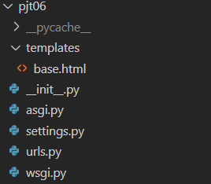

# PJT06 - 사용자인증 기반 웹 페이지 구현


## 1. 목표

- **데이터를 생성, 조회, 수정, 삭제할 수 있는 Web Application 제작**
- **Python Web Framework를 통한 데이터 조작**
- **Authentication에 대한 이해**
- **Database 1:N의 이해와 데이터 관계 설정**


## 2. 준비사항

- 언어
  - Python 3.8.7
  - Django 3.1.7
- 도구
  - vsCode
  - Chrome Browser


## 3. 요구 사항 및 구현 내용

#### A. 프로젝트 구조 및 개발 환경 구축




#### B. Model

- 데이터베이스에서 모델의 ERD(Entity Relation Diagram)
- 직접 정의할 모델 클래스의 이름은 Review와 Comment이며, 아래와 같은 정보를 저장
- 사용자(User) 모델은 django에서 기본 제공하는 모델을 사용


```python
# accounts/models.py
from django.db import models
from django.contrib.auth.models import AbstractUser


class User(AbstractUser):
    pass
```

```python
# community/models.py
from django.db import models
from django.conf import settings


class Review(models.Model):
    user = models.ForeignKey(settings.AUTH_USER_MODEL, on_delete=models.CASCADE)
    title = models.CharField(max_length=100)
    movie_title = models.CharField(max_length=50)
    rank = models.IntegerField()
    content = models.TextField()
    created_at = models.DateTimeField(auto_now_add=True)
    updated_at = models.DateTimeField(auto_now=True)


class Comment(models.Model):
    user = models.ForeignKey(settings.AUTH_USER_MODEL, on_delete=models.CASCADE)
    review = models.ForeignKey(Review, on_delete=models.CASCADE)
    content = models.CharField(max_length=100)
```

```bash
# terminal
$ python manage.py makemigrations
$ python manage.py migrate
```


#### C. Form

- Review, Comment의 데이터 검증, 저장, 에러메세지, HTML을 모두 관리하기 위해 ModelForm을 사용
- User의 데이터 검증, 저장, 에러메세지, HTML을 모두 관리하기 위해 django에서 제공하는 ModelForm, Form을 사용

```python
# accounts/forms.py
from django.contrib.auth.forms import UserCreationForm
from django.contrib.auth import get_user_model


class CustomUserCreationForm(UserCreationForm):

    class Meta(UserCreationForm.Meta):
        model = get_user_model()
        fields = UserCreationForm.Meta.fields + ('email', 'first_name', 'last_name',)
```

```python
# community/forms.py
from django import forms
from .models import Review, Comment


class ReviewForm(forms.ModelForm):

    class Meta:
        model = Review
        exclude = ('user',)


class CommentForm(forms.ModelForm):

    class Meta:
        model = Comment
        fields = ('content',)
```


#### D. Admin

- Review, Comment는 관리자 페이지에서 데이터의 생성, 조회, 수정, 삭제 가능해야 함
- Customizing한 User를 admin site에 register

```bash
# accounts/admin.py
from django.contrib import admin
from .models import User

admin.site.register(User)
```

```python
# community/admin.py
from django.contrib import admin
from .models import Review, Comment


class ReviewAdmin(admin.ModelAdmin):
    list_display = ('pk', 'title', 'movie_title', 'rank', 'content', 'created_at', 'updated_at', 'user_id')

class CommentAdmin(admin.ModelAdmin):
    list_display = ('pk', 'content', 'review_id', 'user_id')

admin.site.register(Review, ReviewAdmin)
admin.site.register(Comment, CommentAdmin)
```


#### E. URL

- URL은 app_name과 name을 설정하여 적용

  ```python
  # pjt06/urls.py
  from django.contrib import admin
  from django.urls import path, include
  
  urlpatterns = [
      path('admin/', admin.site.urls),
      path('community/', include('community.urls')),
      path('accounts/', include('accounts.urls')),
  ]
  ```

  - accounts app

    - accounts app의 모든 URL 패턴은 /accounts로 시작

    ```python
    # accounts/urls.py
    from django.urls import path
    from . import views
    
    
    app_name = 'accounts'
    
    urlpatterns = [
        path('signup/', views.signup, name='signup'),
        path('login/', views.login, name='login'),
        path('logout/', views.logout, name='logout'),
    ]
    
    ```

  - community app

    - community app의 모든 URL 패턴은 /community로 시작

    ```python
    # community/urls.py
    from django.urls import path
    from . import views
    
    
    app_name = 'community'
    
    urlpatterns = [
        path('', views.index, name='index'),
        path('create/', views.create, name='create'),
        path('<int:review_pk>/', views.detail, name='detail'),
        path('<int:review_pk>/comments', views.create_comment, name='create_comment'),
    ]
    
    ```

    

#### F. View & Template

- **공유 템플릿 생성 및 사용**

  - 모든 HTML파일은 base.html을 확장(extends)하여 사용
  - base.html은 모든 페이지가 공유하는 상단 네비게이션 바를 표시
  - 네비게이션 바
    - 전체 리뷰 목록 조회 페이지와 새로운 리뷰 작성 페이지로 이동할 수 있는 링크를 포함
    - 사용자가 인증되어 있지 않다면, 로그인 페이지와 회원 가입 페이지로 이동할 수 있는 링크를 포함
    - 사용자가 인증되어 있다면, 로그아웃 할 수 있는 링크를 표시

  ```django
  <!-- pjt06/templates/base.html -->
  
  
  <!DOCTYPE html>
  <html lang="en">
  <head>
    <meta charset="UTF-8">
    <meta http-equiv="X-UA-Compatible" content="IE=edge">
    <meta name="viewport" content="width=device-width, initial-scale=1.0">
    
    <title>Document</title>
  </head>
  <body>
    <nav class="navbar navbar-light bg-light">
      <div class="d-flex justify-content-between bd-highlight mb-3">
        <div>
          <a class="navbar-brand" href="">INDEX</a>
          <a class="navbar-brand" href="">CREATE</a>
        </div>
        <div>
          
            <form action="" method="POST">
              
              <input type="submit" value="로그아웃">
            </form>
          
            <a class="navbar-brand" href="">회원가입</a>
            <a class="navbar-brand" href="">로그인</a>
          
        </div>
      </div>
    </nav>
  {{ request.user.username }}
    <div class="container">
      
      
    </div>
    
  </body>
  </html>
  ```

- **신규 사용자 생성(회원가입)**

  - 이미 인증되어 있는 사용자는 전체 리뷰 페이지로 redirect
  - django에서 제공하는 UserCreationForm을 상속받는 Custom 클래스를 만들어서 사용
  - HTTP method GET
    - 사용자에게 응답으로 제공할 HTML은 accounts/signup.html
    - 회원가입을 할 수 있는 form을 표시
  - HTTP method POST
    - 데이터가 유효(valid)하다면 요청과 함께 전송된 데이터를 데이터베이스에 저장
    - 그 후 사용자를 인증(로그인)하고 전체 리뷰 목록 페이지로 redirect
    - 데이터가 유효하지 않다면 에러메세지를 포함하여, 데이터를 작성하는 form을 사용자 화면에 표시

  ```python
  # accounts/forms.py
  from django.contrib.auth.forms import UserCreationForm
  from django.contrib.auth import get_user_model
  
  
  class CustomUserCreationForm(UserCreationForm):
  
      class Meta(UserCreationForm.Meta):
          model = get_user_model()
          fields = UserCreationForm.Meta.fields + ('email', 'first_name', 'last_name',)
  ```

  ```python
  # accounts/views.py
  from django.shortcuts import render, redirect
  from django.views.decorators.http import require_http_methods
  from .forms import CustomUserCreationForm
  from django.contrib.auth import login as auth_login
  
  
  @require_http_methods(['POST', 'GET'])
  def signup(request):
      if request.user.is_authenticated:
          return redirect('community:index')
      if request.method == 'POST':
          form = CustomUserCreationForm(request.POST)
          if form.is_valid():
              user = form.save()
              auth_login(request, user)
              return redirect('community:index')
      else:
          form = CustomUserCreationForm()
      context = {
          'form':form,
      }
      return render(request, 'accounts/signup.html', context)
  ```

  ```django
  <!-- accounts/templates/accounts/signup.html -->
  
  
  
    <h1>SIGNUP PAGE</h1>
    <hr>
  
    <form action="" method="POST">
      
      {{ form.as_p }}
      <input type="submit" value="회원가입">
    </form>
  
  ```

- **기존 사용자 인증(로그인)**

  - 이미 인증되어있는 사용자는 전체 리뷰 목록 페이지로 redirect
  - django에서 제공하는 AuthenticationForm을 사용
  - HTTP method GET
    - 사용자에게 응답으로 제공할 HTML은 accounts/login.html
  - HTTP method POST
    - 데이터가 유효하다면  요청과 함께 전송된 데이터를 통해 사용자를 인증
      - 로그인하기 전, 기존 URL이 함께 넘어왔다면 해당 URL로 redirect
      - 기존 URL이 넘어오지 않았다면 전체 리뷰 목록 페이지로 redirect

  ```python
  # accounts/views.py
  from django.shortcuts import render, redirect
  from django.views.decorators.http import require_http_methods
  from django.contrib.auth.forms import AuthenticationForm
  from django.contrib.auth import login as auth_login
  
  
  @require_http_methods(['POST', 'GET'])
  def login(request):
      if request.user.is_authenticated:
          return redirect('community:index')
      if request.method == 'POST':
          form = AuthenticationForm(request, request.POST)
          if form.is_valid():
              auth_login(request, form.get_user())
              return redirect(request.GET.get('next') or 'community:index')
      else:
          form = AuthenticationForm()
      context = {
          'form':form,
      }
      return render(request, 'accounts/login.html', context)
  ```

  ```django
  <!-- accounts/templates/accounts/login.html -->
  
  
  
    <h1>LOGIN PAGE</h1>
    <hr>
  
    <form action="" method="POST">
      
      {{ form.as_p }}
      <input type="submit" value="로그인">
    </form>
  
  ```

- **인증된 사용자 인증해제(로그아웃)**

  - HTTP method POST  선택
  - 사용자의 인증을 해제(로그아웃)하고 전체 리뷰 목록 페이지로 redirect

  ```python
  # accounts/views.py
  from django.shortcuts import redirect
  from django.contrib.auth import logout as auth_logout
  from django.views.decorators.http import require_POST
  
  
  @require_POST
  def logout(request):
      if request.user.is_authenticated:
          auth_logout(request)
      return redirect('community:index')
  ```

- **새로운 리뷰 작성**

  - 인증되어있지 않는 사용자는 next key에  URL을 value로 넣어 login 페이지로 요청 (로그인 후 리뷰 작성 페이지로 redirect 되도록)
  - HTTP method GET
    - 사용자에게 응답으로 제공할 HTML파일은 form.html
  - HTTP method POST
    - 데이터가 유효하다면 요청과 함께 전송된 데이터를 데이터베이스에 저장, 생성된 상세 리뷰 페이지로 redirect
    - 데이터가 유효하지 않다면 에러 메세지를 포함하여 데이터를 작성하는 Form을 표시

  ```python
  # community/views.py
  from django.shortcuts import render, redirect
  from django.contrib.auth.decorators import login_required
  from django.views.decorators.http import require_http_methods
  from .forms import ReviewForm
  
  
  @login_required
  @require_http_methods(['POST', 'GET'])
  def create(request):
      if request.user.is_authenticated:
          if request.method == 'POST':
              form = ReviewForm(request.POST)
              if form.is_valid():
                  review = form.save(commit=False)    # table에는 저장되지 않는 save
                  review.user = request.user          # form에서 user 정보를 입력하지 않기 때문에, request에서 user 정보를 꺼내서 넣어준다.
                  review.save()
                  return redirect('community:index')
          else:
              form = ReviewForm()
          context = {
              'form':form,
          }
          return render(request, 'community/form.html', context)
      return redirect('community:index')
  ```

  ```django
  <!-- community/templates/community.form.html -->
  
  
  
  
    <h1>CREATE PAGE</h1>
    <hr>
  
    <form action="" method="POST" class="d-inline">
      
      
      
      
    </form>
    <a href=""></a>
  
  ```

- **전체 리뷰 목록 조회**

  - 사용자에게 응답으로 제공할 HTML은 index.html
  - title 클릭 시 해당 리뷰의 상세 조회 페이지로 이동

  ```python
  # community/views.py
  from django.shortcuts import render
  from django.views.decorators.http import require_safe
  from .models import Review
  
  
  @require_safe
  def index(request):
      reviews = Review.objects.order_by('-pk')
      context = {
          'reviews':reviews,
      }
      return render(request, 'community/index.html', context)
  
  ```

  ```django
  <!-- community/templates/community/index.html -->
  
  
  
    <h1>INDEX PAGE</h1>
    <hr>
    
      <div class="card" style="width: 18rem; margin:10px 0px;">
      <div class="card-body">
        <h5 class="card-title"><a href="">{{ review.pk }}. {{ review.title }}</a></h5>
        <h6 class="card-subtitle mb-2 text-muted">{{ review.user }}</h6>
        <p class="card-text">{{ review.content }}</p>
      </div>
    </div>
    
      <p>글이 없습니다.</p>
    
  
  ```

- **단일 리뷰 상세 조회**

  - URL을 통해 함께 전달된 review_pk를 id로 갖는 리뷰의 상세정보를 HTML에 표시
  - 응답으로 제공할 HTML은 detail.html
  - review_pk를 id로 갖는 리뷰 데이터가 없을 경우, 404 에러 페이지를 표시
  - detail.html에는 적절한 HTMl 요소를 사용하여, 조회하는 리뷰의 title, movie_title, content, rank, created_at, updated_at을 표시

  ```python
  # community/views.py
  from django.shortcuts import render, get_object_or_404
  from django.views.decorators.http import require_safe
  from .models import Review
  
  @require_safe
  def detail(request, review_pk):
      review = get_object_or_404(Review, pk=review_pk)
      context = {
          'review':review,
      }
      return render(request, 'community/detail.html', context)
  
  ```

  ```django
  <!-- community/templates/community/detail.html -->
  
  
  
    <h1>DETAIL PAGE</h1>
    <hr>
    <div class="container">
      <p>글 번호 : {{ review.pk }}</p>
      <p>작성자 : {{ review.user }}</p>
      <p>제목 : {{ review.title }}</p>
      <p>영화 제목 : {{ review.movie_title }}</p>
      <p>내용 : {{ review.content }}</p>
      <p>순위 : {{ review.rank }}</p>
      <p>작성일 : {{ review.created_at }}</p>
      <p>수정일 : {{ review.updated_at }}</p>
    </div>
  
  ```

- **댓글 생성**

  - 단일 리뷰 상세 조회 페이지에서 댓글을 작성할 수 있는 Form을 표시
  - Form에 작성한 정보는 제출(submit)시, POST 방식으로 요청과 데이터를 detail URL로 전송
  - 데이터가 유효하다면 요청과 함께 전송된 데이터를 데이터베이스에 저장, 댓글을 작성하던 단일 리뷰 상세 페이지로 redirect

  ```python
  # community/views.py
  from django.shortcuts import render, get_object_or_404, redirect
  from django.views.decorators.http import require_safe, require_POST
  from .models import Review
  from .forms import CommentForm
  
  
  @require_safe
  def detail(request, review_pk):
      review = get_object_or_404(Review, pk=review_pk)
      comments = review.comment_set.all()  # 지금 들어온 review 페이지를 참조하는 comment만 가져오는거죠.
      # comment = Comment.objects.all()   # Comment db의 모든 comment을 가져옴. 지금 들어온  review 페이지랑 상관 X
      comment_form = CommentForm()
      context = {
          'review':review,
          'comments':comments,
          'comment_form':comment_form,
      }
      return render(request, 'community/detail.html', context)
  
  
  @require_POST
  def create_comment(request, review_pk):
      if request.user.is_authenticated:
          review = get_object_or_404(Review, pk=review_pk)
          comment_form = CommentForm(request.POST)
          if comment_form.is_valid():
              comment = comment_form.save(commit=False)
              comment.user = request.user
              comment.review = review
              comment.save()
              return redirect('community:detail', review.pk)
          context = {
              'comment_form':comment_form,
              'review':review,
          }
          return render(request, 'community/detail.html', context)
      return redirect('community:index')
  ```

  ```django
  <!-- community/templates/community/detail.html -->
  
  
  
    <h1>DETAIL PAGE</h1>
    <hr>
    <div class="container">
      <p>글 번호 : {{ review.pk }}</p>
      <p>작성자 : {{ review.user }}</p>
      <p>제목 : {{ review.title }}</p>
      <p>영화 제목 : {{ review.movie_title }}</p>
      <p>내용 : {{ review.content }}</p>
      <p>순위 : {{ review.rank }}</p>
      <p>작성일 : {{ review.created_at }}</p>
      <p>수정일 : {{ review.updated_at }}</p>
    </div>
    <hr>
    
    
      <p>{{ comment.user }}: {{ comment.content }}</p>
    
      <p>댓글이 없습니다.</p>
    
    <form action="" method="POST">
      
      {{ comment_form }}
      <input type="submit" value="작성">
    </form>
  
  ```

  

